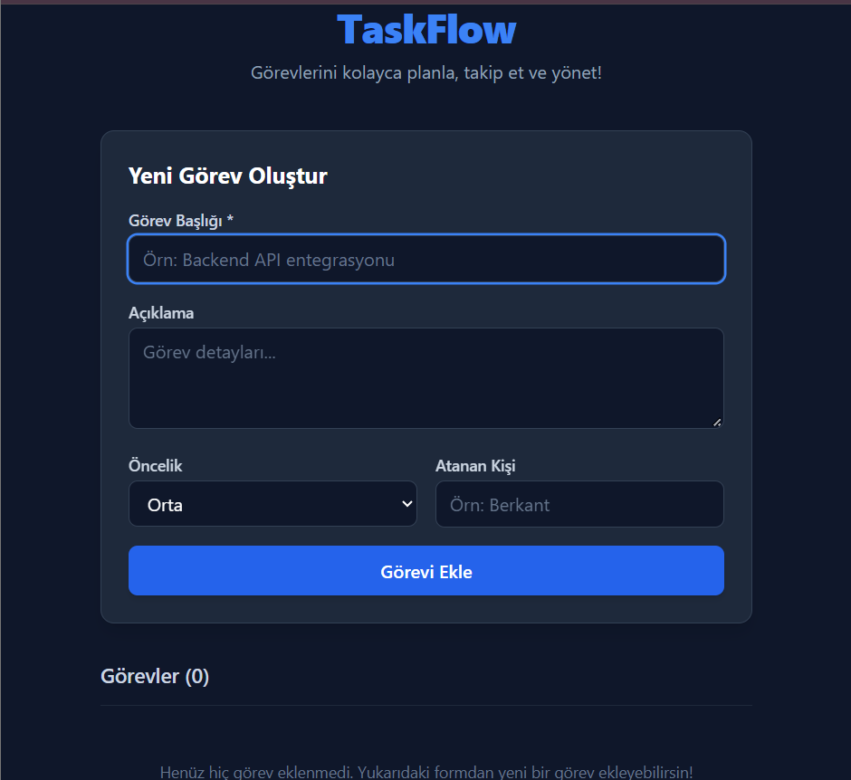
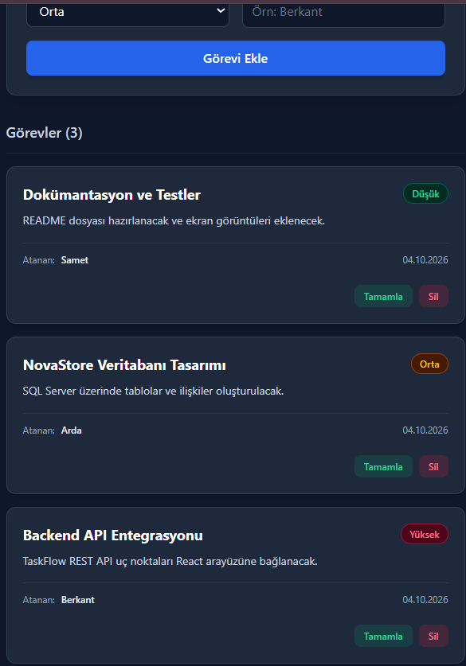
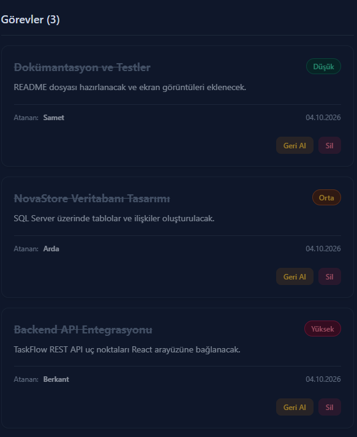
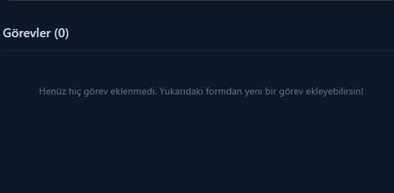

# TaskFlow - Task & Project Management Dashboard

  
  
<em>Modern, responsive and local-storage backed task management dashboard</em>

  
   
  
  

    <strong>Dil Secimi / Select Language:</strong> 
    <a href="#tr">Turkce Dokumantasyon</a>
    &nbsp;&nbsp;|&nbsp;&nbsp;
    <a href="#en">English Documentation</a>
  

---

## Application Screenshots

| 01. Ekleme ve Listeleme | 02. Durum Guncelleme | 03. Silme ve Bos Durum |
| :---: | :---: | :---: |
|  |  |  |

---

## Turkce Dokumantasyon

### Proje Hakkinda ve Mimari Yaklasim
TaskFlow, bireylerin ve ekiplerin gunluk is yuklerini, proje sureclerini ve gorevlerini organize etmeleri amaciyla gelistirilmis modern bir Tek Sayfa Uygulamasidir (Single Page Application). Geleneksel web sayfalarinin aksine, sayfa yenilenmesine gerek kalmadan hizli ve akici bir deneyim sunar. Uygulama, tum verileri kullanicinin tarayicisinda (localStorage) saklayarak harici bir sunucuya ihtiyac duymadan tamamen bagimsiz ve cevrimdisi calisabilme yetenegine sahiptir.

### Kullanilan Teknolojiler
- **Frontend Altyapisi:** React 18 (Vite derleyicisi ile yuksek performansli gelistirme ortami).
- **Kullanici Arayuzu (UI):** Tailwind CSS kullanilarak utility-first yaklasimiyla tasarlanmis karanlik tema (Dark Mode) odakli modern tasarim.
- **Durum Yonetimi (State):** React Hooks (useState, useEffect) mimarisi ile bilesenler arasi veri iletimi.
- **Veri Kaliciligi:** Web Storage API (localStorage) kullanilarak verilerin sayfa yenilemelerinde kaybolmasinin onlenmesi.

### Temel Ozellikler ve CRUD Operasyonlari
- **Gorev Olusturma (Create):** Kullanicilar gorev basligi, detayli aciklama ve oncelik seviyesi (Dusuk, Orta, Yuksek) belirterek yeni gorevler ekleyebilir. Form dogrulama (validation) mekanizmasi bos kayitlari engeller.
- **Dinamik Listeleme (Read):** Eklenen gorevler, oncelik seviyelerine gore renk kodlamasi yapilmis kartlar halinde listelenir. Arayuzdeki dinamik sayac, aktif gorev sayisini anlik olarak gosterir.
- **Durum Guncelleme (Update):** Gorevler tek tikla "Tamamlandi" olarak isaretlenebilir. Bu islem gorevin gorsel durumunu (ustunu cizme, saydamlastirma) aninda gunceller ve istendiginde geri alinabilir.
- **Gorev Silme (Delete):** Iptal edilen veya tamamlanan gorevler sistemden tamamen kaldirilabilir. Liste bosaldiginda kullaniciyi yonlendiren ozel bir bos durum (empty state) ekrani devreye girer.

### Kurulum ve Calistirma
Projeyi yerel ortamda calistirmak icin terminal uzerinden asagidaki adimlari izleyebilirsiniz:

    git clone https://github.com/KULLANICI_ADIN/TaskFlow.git
    cd TaskFlow
    npm install
    npm run dev

---

## English Documentation

### Project Overview and Architecture
TaskFlow is a modern Single Page Application (SPA) developed to help individuals and teams seamlessly organize their daily workloads, project milestones, and tasks. Unlike traditional web applications, it provides a fast, fluid experience without requiring page reloads. By utilizing the browser's local storage, the application operates entirely independently and can function offline without needing an external database or backend server.

### Technology Stack
- **Frontend Framework:** React 18 (Bootstrapped with Vite for a high-performance development experience).
- **User Interface (UI):** Tailwind CSS implemented with a utility-first approach to create a sleek, Dark Mode-focused modern design.
- **State Management:** React Hooks architecture (useState, useEffect) for robust data flow between components.
- **Data Persistence:** Web Storage API (localStorage) integration to ensure zero data loss upon page refreshes.

### Core Features (CRUD Operations)
- **Create Tasks:** Users can add new tasks by specifying a title, a detailed description, and a priority level (Low, Medium, High). Built-in form validation prevents the submission of empty fields.
- **Read & Display:** Tasks are dynamically rendered as cards with priority-based color coding. A live counter updates the total number of active tasks in real-time.
- **Update Status:** Tasks can be marked as completed with a single click, applying a strike-through effect and reducing opacity. This action can be undone instantly.
- **Delete Tasks:** Canceled or completed tasks can be permanently removed from the dashboard. An intuitive empty state screen is displayed when no tasks remain.

### Local Installation
To run the project locally on your machine, follow these steps in your terminal:

    git clone https://github.com/KULLANICI_ADIN/TaskFlow.git
    cd TaskFlow
    npm install
    npm run dev