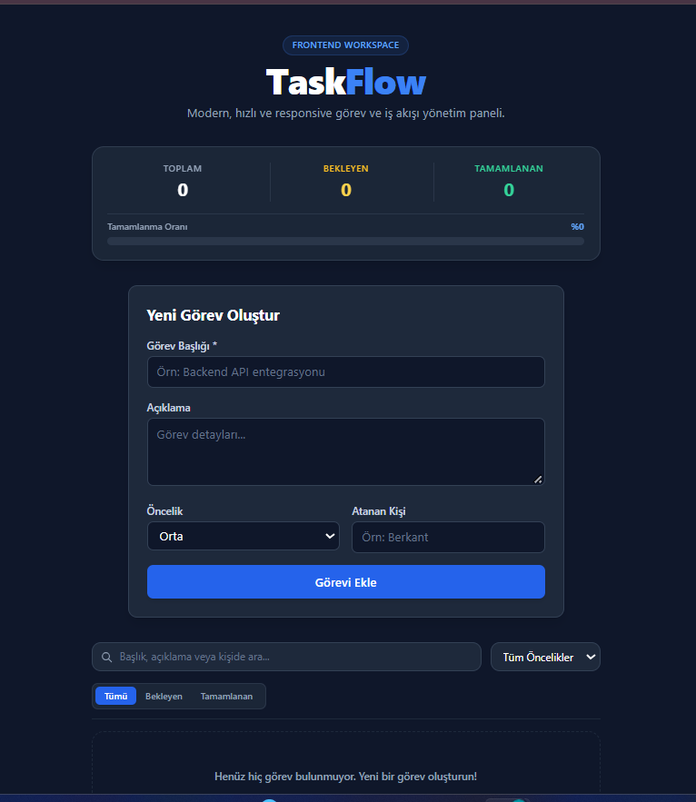
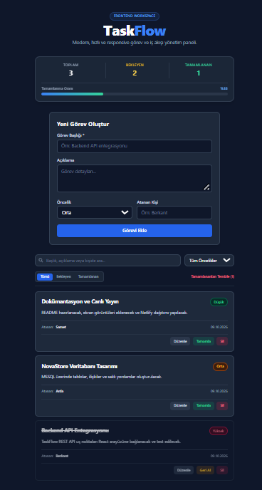

# TaskFlow — Task & Project Management Dashboard

<div align="center">

  
  <p><em>Modern, responsive, LocalStorage-backed task management dashboard deployed on Netlify</em></p>
  
  <br />
  
  <!-- BADGES -->
  <a href="https://react.dev/"></a>
  <a href="https://vite.dev/"></a>
  <a href="https://tailwindcss.com/"></a>
  <a href="https://www.netlify.com/"></a>
  

  <br /><br />

  Canli Onizleme / Live Demo:  
  https://wondrous-dodol-2a59f8.netlify.app

  <br /><br />

  <p>
    <strong>Dil Secimi / Select Language:</strong><br />
    <a href="#turkce-dokumantasyon">Turkce Dokumantasyon</a>
    &nbsp;&nbsp;|&nbsp;&nbsp;
    <a href="#english-documentation">English Documentation</a>
  </p>
</div>

---

## Ekran Goruntuleri / Screenshots

| 01. Form ve Gorev Olusturma (Create Task) | 02. Listeleme ve Ilerleme Paneli (Read & Metrics) |
| :---: | :---: |
|  |  |
| **03. Duzenleme Modu (Inline Edit & Update)** | **04. Canli Arama ve Filtreleme (Live Search & Filter)** |
|  |  |
| **05. Silme ve Bos Durum (Delete & Empty State)** | **06. Netlify Canli Yayin (Live Production)** |
|  |  |

---

<a name="turkce-dokumantasyon"></a>
## Turkce Dokumantasyon

### Proje Hakkinda ve Mimari Yaklasim
TaskFlow, modern on yuz gelistirme standartlarina uygun olarak gelistirilmis hizli, reaktif ve kullanici dostu bir Tek Sayfa Uygulamasidir (Single Page Application - SPA). Proje, Software Persona Web Gelistirme Javascript bitirme projesi gereksinimlerini eksiksiz karsilayacak sekilde; tam CRUD dongusu, gelismis filtreleme mekanizmalari, canli metrik hesaplamalari ve kesintisiz veri kaliciligi sunar.

Geleneksel web sayfalarinin aksine sayfa yenilenmesine gerek kalmadan akici bir deneyim saglar. Uygulama, tum verileri kullanicinin tarayicisinda (localStorage) saklayarak harici bir sunucuya veya veritabanina ihtiyac duymadan tamamen bagimsiz calisir; sayfa yenilendiginde veya tarayici kapatildiginda veriler kaybolmaz.

### Temel Ozellikler ve CRUD Operasyonlari
- Gorev Olusturma (Create): Kullanicilar gorev basligi, detayli aciklama, oncelik derecesi (Dusuk, Orta, Yuksek) ve atanan kisi bilgisi belirterek yeni gorevler ekleyebilir. Form dogrulama mekanizmasi bos baslik girislerini engeller.
- Dinamik Listeleme (Read): Eklenen tum gorevler, oncelik seviyelerine gore renk kodlamasi yapilmis kartlar halinde, atanan kisi etiketi ve olusturulma tarihiyle listelenir.
- Duzenleme ve Durum Guncelleme (Update): Kart uzerinde acilan dogrudan duzenleme (inline edit) modu ile baslik, aciklama ve oncelik aninda guncellenebilir. Tek tikla gorev "Tamamlandi" olarak isaretlenebilir veya geri alinabilir.
- Gorev Silme (Delete): Tamamlanan veya iptal edilen gorevler tek tek kaldirilabilir. Tamamlanan gorevlerin tumu tek tusla topluca silinebilir. Liste bosaldiginda kullaniciyi yonlendiren bilgilendirici bir bos durum (empty state) ekrani devreye girer.
- Canli Analitik ve Ilerleme Paneli: Toplam, bekleyen ve tamamlanan gorev sayisi anlik olarak hesaplanir ve yuzdelik dinamik ilerleme cubugu ile gorsellestirilir.
- Canli Arama ve Filtreleme: Gorev basligi, aciklamasi ve atanan kisi adina gore anlik metin aramasi yapilabilir; durum sekmeleri (Tumu, Bekleyen, Tamamlanan) ve oncelik secicisi ile cok kriterli filtreleme saglanir.
- Koyu Tema Tasarim: Tailwind CSS ile hazirlanmis responsive, modern ve mobil uyumlu koyu tema arayuzu.

### Kullanilan Teknolojiler
- On Yuz Kutuphanesi: React 18
- Derleme ve Gelistirme Araci: Vite
- Stil ve Tasarim: Tailwind CSS v3
- Durum Yonetimi (State Management): React Hooks (useState, useEffect, useMemo)
- Veri Kaliciligi: Web Storage API (localStorage)
- Dagitim ve Barindirma: Netlify

### Yerel Kurulum ve Calistirma
```bash
# Repoyu klonlayin
git clone [https://github.com/berkantkilic777-gif/taskflow-frontend.git](https://github.com/berkantkilic777-gif/taskflow-frontend.git)

# Proje calisma dizinine gecin
cd taskflow-frontend/taskflow-frontend

# Bagimliliklari yukleyin
npm install

# Gelistirme sunucusunu baslatin
npm run dev

# Uretim derlemesi alin
npm run build
```

---

<a name="english-documentation"></a>
## English Documentation

### Project Overview and Architecture
TaskFlow is a modern, high-performance Single Page Application (SPA) designed to streamline task and workflow management. Built to fully satisfy the graduation criteria for the Software Persona Web Development curriculum, it demonstrates complete CRUD functionality, client-side data persistence, dynamic filtering, and real-time dashboard analytics.

Unlike traditional multi-page applications, TaskFlow provides a seamless user experience without requiring full page reloads. By utilizing the browser Web Storage API (localStorage), the application operates independently without requiring an external backend server; data persists across browser sessions and page refreshes.

### Key Features and CRUD Operations
- Create Tasks: Users can add tasks with a title, detailed description, priority level (Low, Medium, High), and assigned team member. Built-in input validation prevents empty submissions.
- Read and Display: Rendered task cards display priority-coded badges, assignee labels, and timestamps dynamically.
- Update Status and Content: Inline card editing allows real-time updates to task titles, descriptions, and priority levels. Tasks can also be toggled between active and completed states with a single click.
- Delete Tasks: Users can remove tasks individually or bulk-delete all completed tasks. An informative empty state screen is displayed when no tasks remain.
- Progress and Metrics Dashboard: Real-time indicators track total, pending, and completed tasks alongside an automated percentage progress bar.
- Live Search and Multi-Faceted Filtering: Instant string matching across titles, descriptions, and assignees; combined with status tabs (All, Pending, Completed) and priority dropdown filtering.
- Modern Dark UI: Utility-first, mobile-responsive dark theme crafted with Tailwind CSS.

### Tech Stack
- Frontend Framework: React 18
- Build Tool: Vite
- Styling: Tailwind CSS v3
- State Management: React Hooks (useState, useEffect, useMemo)
- Data Persistence: Web Storage API (localStorage)
- Deployment and Hosting: Netlify

### Local Installation and Setup
```bash
# Clone the repository
git clone [https://github.com/berkantkilic777-gif/taskflow-frontend.git](https://github.com/berkantkilic777-gif/taskflow-frontend.git)

# Navigate to the workspace directory
cd taskflow-frontend/taskflow-frontend

# Install dependencies
npm install

# Start development server
npm run dev

# Build for production
npm run build
```

---

## Proje Dizin Yapisi / Project Structure

```text
taskflow-frontend/
├── screenshots/
│   ├── 01-create-and-form.png
│   ├── 02-list-and-metrics.png
│   ├── 03-edit-and-update.png
│   ├── 04-search-and-filter.png
│   ├── 05-delete-task.png
│   └── 06-live-deployment.png
├── taskflow-frontend/
│   ├── public/
│   ├── src/
│   │   ├── components/
│   │   │   ├── TaskCard.jsx
│   │   │   └── TaskForm.jsx
│   │   ├── App.jsx
│   │   ├── index.css
│   │   └── main.jsx
│   ├── index.html
│   ├── package.json
│   ├── tailwind.config.js
│   └── vite.config.js
├── netlify.toml
└── README.md
```

---

## Proje Teslim Kriterleri Uyumlulugu / Rubric Compliance

Bu proje Software Persona Web Gelistirme egitim yonergesinde belirtilen tum sartlari eksiksiz karsilamaktadir:

- [x] Modern JavaScript kutuphanesi (React + Vite) kullanimi
- [x] Tailwind CSS entegrasyonu ve responsive arayuz tasarimi
- [x] Veri kaliciligi icin LocalStorage entegrasyonu
- [x] Zorunlu CRUD islemlerinin tamami (Ekle, Listele, Guncelle, Sil)
- [x] Ilerleme cubugu, anlik arama ve oncelik filtreleri
- [x] Adim adim gorsel kanitlar (screenshots/ dizini altinda 6 adet ekran goruntusu)
- [x] Herkese acik (Public) GitHub deposu
- [x] Netlify uzerinde 7/24 aktif canli yayin

---

## Gelistirici / Author

- Berkant Kilic
- GitHub: https://github.com/berkantkilic777-gif
- Canli Dagitim / Live Demo: https://wondrous-dodol-2a59f8.netlify.app